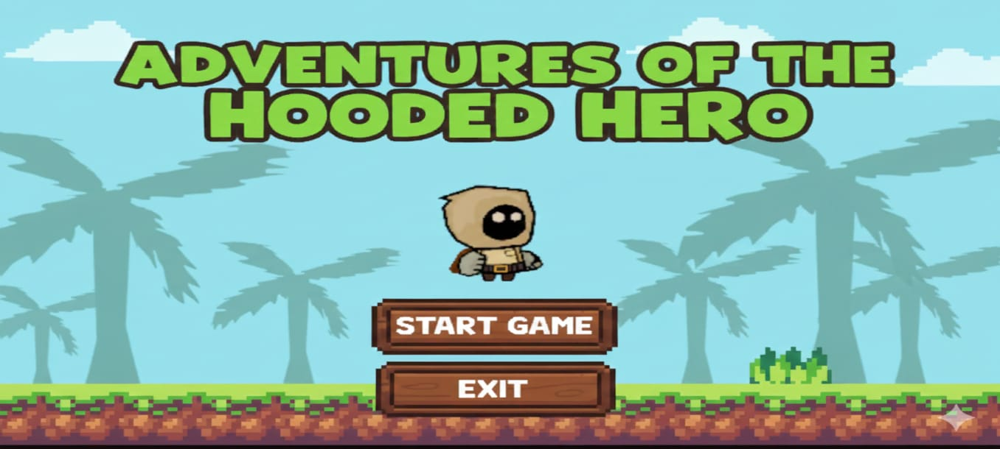
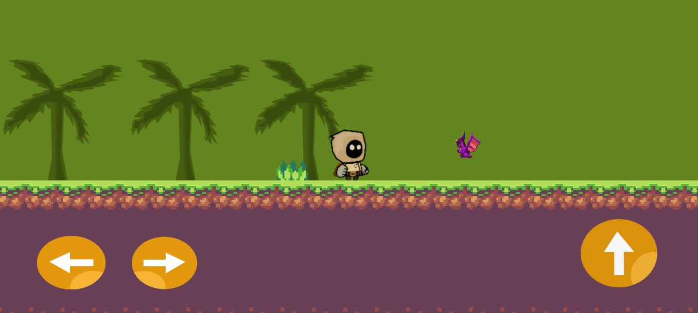

# Las aventuras del héroe encapuchado
Adventures of the Hooded Hero es un juego de plataformas en 2D desarrollado en Unity. El jugador controla a un valiente héroe encapuchado que debe sortear obstáculos, evitar enemigos (como murciélagos) y llegar al final del nivel para alcanzar la victoria.

*🚀 Características*

Jugabilidad Clásica : Mecánicas de plataformas con movimiento fluido y saltos precisos.

Sistema de Límites : El jugador está restringido a los bordes de la pantalla para una experiencia de juego enfocada.

Enemigos Desafiantes : Contacto letal con enemigos que reinicia el nivel instantáneamente.

Interfaz multiplataforma : Menús adaptables y controles táctiles dinámicos que se ocultan automáticamente en versiones de escritorio.

Condición de Victoria : Sistema de detección de posición para pasar a la pantalla de "YOU WIN".

*⚙️ Tecnologías y Requisitos*

Este proyecto ha sido desarrollado íntegramente dentro del ecosistema de Unity, utilizando C# para toda la lógica del juego.

Requisitos del sistema
Para abrir y trabajar con el código fuente del proyecto, necesitarás:

**Motor de juego**: Unity 6 (6000.2.6f1) o Unity 6.0 (6000.0.58f1) LTS .

**Idioma de programación**: C# (Se incluye automáticamente con la instalación de Unity).

**IDE (Entorno de Desarrollo Integrado)**: Visual Studio es el recomendado para editar y depurar los scripts de C#.

*🕹️ Controles*

**Escritorio (PC/Mac)**

Moverse : Teclas A/ Do Flechas de dirección.

Saltar : Barra espaciadora ( Space).

**Móvil (Android/iOS)**

Joystick/Botones en pantalla : Controles táctiles dedicados en la parte inferior de la interfaz.

*🎮 Muestra del juego*





*📝 Guiones principales*

**MovimientoJugador.cs:** Gestiona la física del personaje y aplica el Mathf.Clamp para los límites de pantalla.
```
Vector3 pos = transform.position;

pos.x = Mathf.Clamp(pos.x, min, max);

transform.position = pos;

```


**Enemigo.cs:** Controla la detección de colisiones mediante OnCollisionEnter2Dpara reiniciar la escena.

**Botones.cs:** Maneja la lógica de navegación entre menús (Iniciar, Reiniciar, Salir).

**VisibilidadBotones.cs:** Detecta la plataforma activa para mostrar u ocultar la interfaz táctil.
